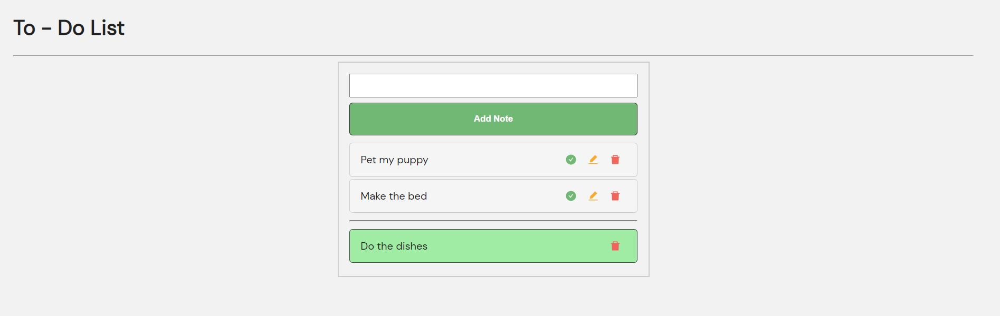

# To Do App
Project based on adding chores on a list through an input field where you can also set them done, edit or delete.

## Preview

### Give it a try!
**<https://todo-app-sum.herokuapp.com/#/>**

### Technologies used

### To start this project:
- npm install
- npm run dev
